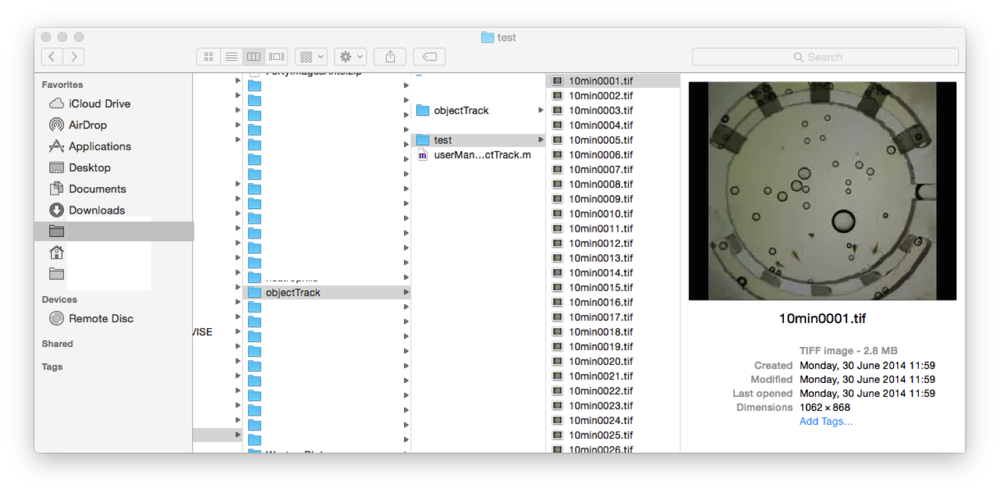
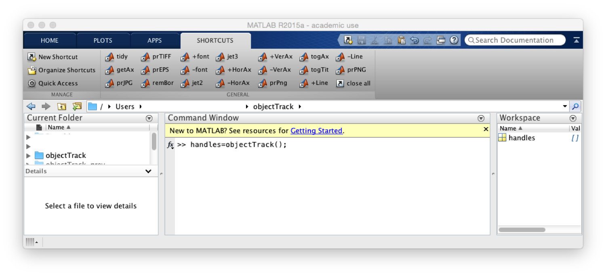
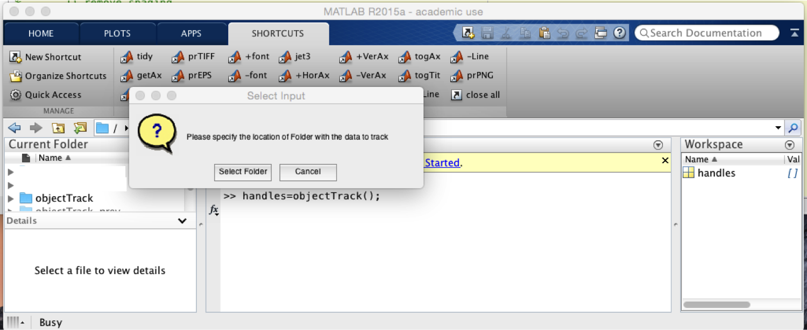
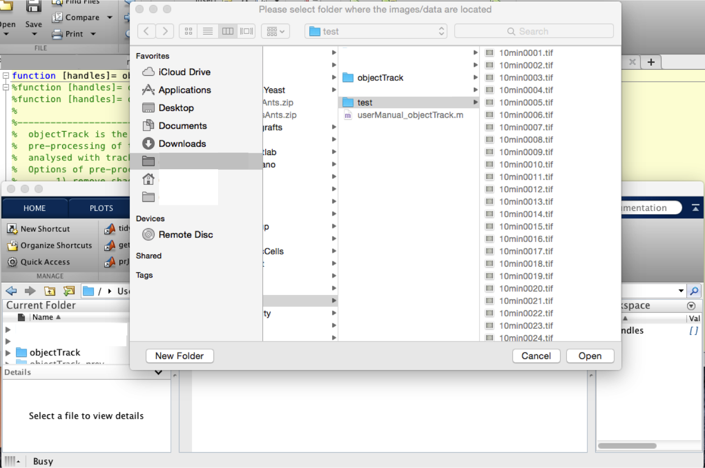
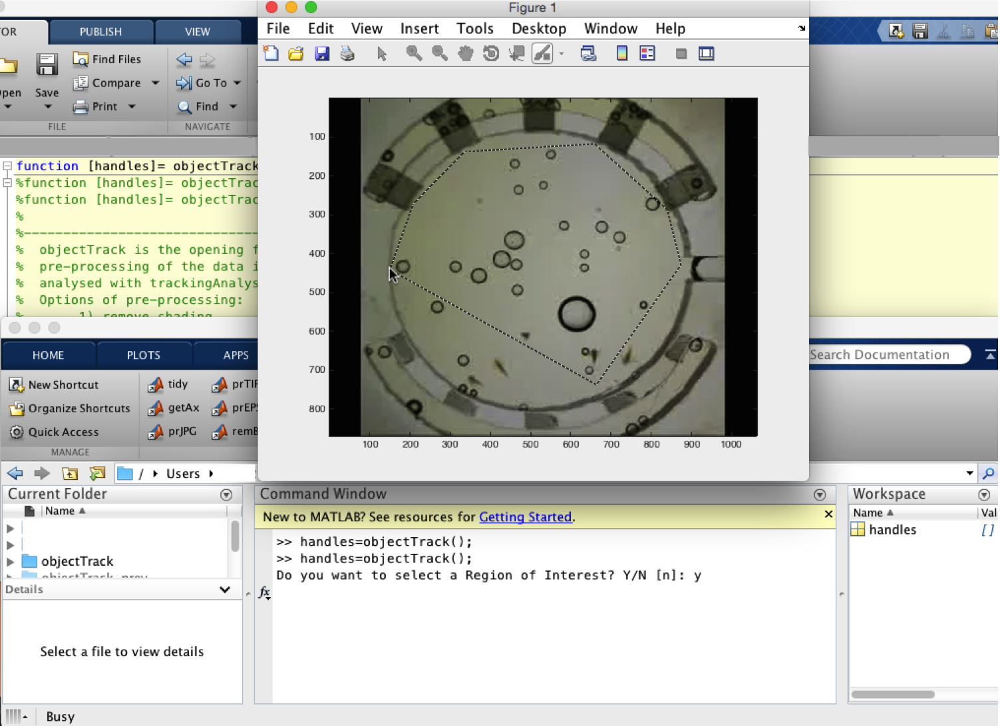
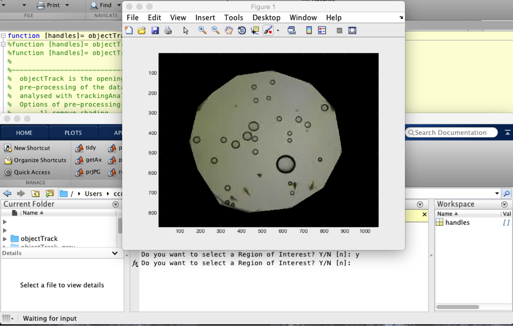
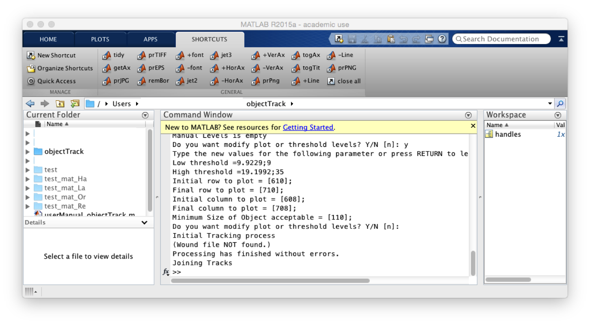
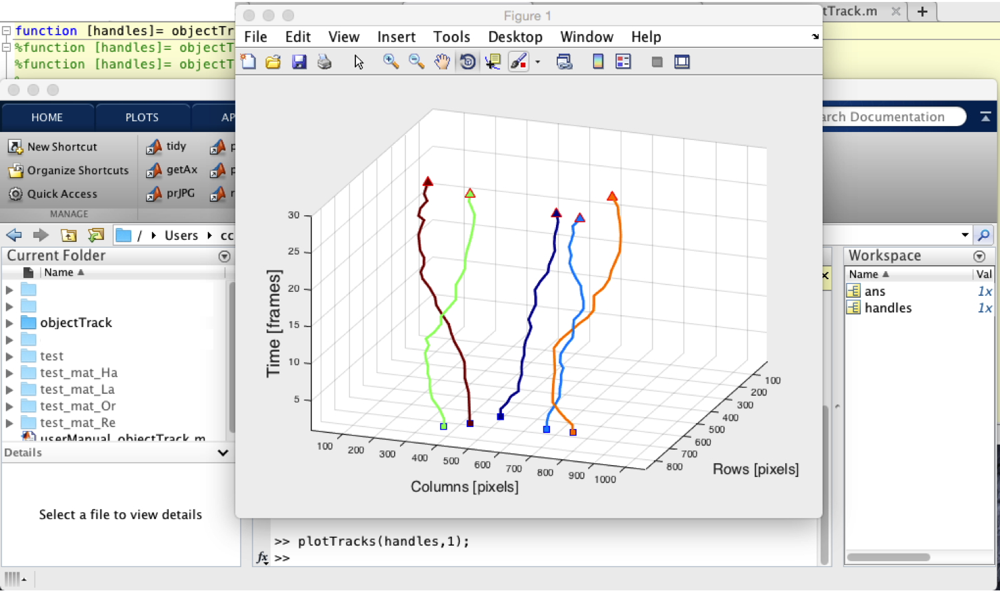

# object-track
Tracking of objects, especially Artemia Franciscana

<h1>Object Track</h1>
  <!--introduction-->
  
  
 
<b><i>objectTrack</i></b> is a collection of Matlab routines that can be used to track objects from videos. <b><i>objectTrack</i></b> was designed to track small objects that are visible and can be distinguished from their background relatively easily, it is not intended for objects that are too close to each other or situations where the clutter makes it difficult to distinguish the objects themselves.
 
 <!--/introduction--> 
 
<b><i>objectTrack</i></b> has a series of pre-processing steps that allow the subtraction of background so that the object can be segmented by intensity. The segmentation is done with a double hysteresis threshold which is a fast and effective technique, not as powerful as neural networks or deep learning, but far quicker than these or other sophisticated algorithms. Tracking is performed with a Keyhole Model of Movement. For description of the techniques see the references below.
 
  
 
<b><i>objectTrack</i></b> has numerous visualisation tools that allow the generation of graphics. In addition, a large number of measurements can be obtained with a minimum effort from the user.
 
  
 
User interaction is restricted to the following:     (a) Selection of a mask at the beginning of the pre-processing     (b) Selection of threshold levels and a minimum size of object.
 
 
  
  <h1>User Manual</h1>
  
 
 
 <b><i>objectTrack</i></b> can take input in many ways, but one of the most convenient is to store all time points as images, one per time point, and store these in one folder. For example, we have placed a series of images inside a folder called 'test' like this:
 
 

 
 
 
 

 
   
 
 
To start the interface you need to type the following code in the Command Window of Matlab 
 
 

  <pre class="codeinput">[handles]=objectTrack();
</pre>
   

 
  
 

 
 
Once you hit enter on the command line, <b><i>objectTrack</i></b> will start. You may provide the folder of interest from the very beginning like this:
 
 
  <pre class="codeinput">[handles]=objectTrack('test');
</pre>

 
 
However, you may leave that blank and then a window will open and from there you can select the correct folder where data is stored: 
 
 

 
  

 
 
  

 
  

 
 
 
 
In the example the folder 'test' contains 30 images corresponding to the movement of 5 objects. 

 
 
The first option that the software provides to the user is to designate a region of interest so that the analysis is performed only within this region. If you accept by typing 'y' a new window will appear with the first image of the series. There you can select manually the points of the region.
 
 

 
  

 
 
 
 
 
After the region has been selected, the result is shown to the user and the option to select a new region is offered, in case an error was made.
 
 

 
  

 
 
 
 
In this example, the images are acquired with light microscopy, therefore the background is not immediately evident. To be able to segment the objects by intensity, the software can subtract the background, which is calculated from the mean intensity projection from all the time points. This is an option for the user to accept. 
 
 
 
 
The next step is the segmentation process. This is done with a double threshold with the objective of determining one low threshold below which all pixels are considered as background, a high threshold above which all pixels are considered as an object (or foreground) and those pixels in between are assigned to the class to which they are next to.
 
 

 
  and a small region of interest (below). The central panel presents the image with the background removed, whole and the ROI. The right graph is a histogram of three time point of the data (first, middle, last).
 
 
 
 
The third important parameter is the minimum size acceptable. That is, the software will perform the segmentation and will discard, if so decided, all objects below a certain size. In this example, the initial segmentation found 7 objects with sizes ranging from 967 to 20 pixels, however, there are only 5 objects of interest, so a suitable value of 110 can discard small objects that correspond to noise.

 
 
 
 

When the processing has finished, The command window of Matlab will show something similar to the figure below. Notice that there is one variable called 'handles', which contains all the measurements related to the tracking of the objects.
 
 

 
  

 
 
 
  
 
Besides the handles, the software has created a series of folders where the data has been stored. These folders will have the same name as the original folder (test) but with the following extensions: 
<ul>
 <li><i>_mat_Or</i>, Each  original time point has been stored in Matlab format, as a single file
<li><i>_mat_Re</i>, The data can be reduced in dimensions, and stored as a file for each time point
<li><i>_mat_La</i>, The segmented data with labels for each object segmented
<li><i>_mat_Ha</i>, The handles with the final results.
</ul>
 
 
In addition, one more folder can be created when creating videos, <i>_mat_Vi</i>. 
 

 
 
 To display the data, you can use the command plotTracks like this:
 
 
  <pre class="codeinput">
  plotTracks(handles,1);
</pre>

 
  

 
 

   
 
 
 In some cases it is useful to generate a video of the objects that have been tracked. It will show you the segmented objects and a series of lines that represent the tracks, from the starting to the end of the track. The colours of the tracks are related to the velocity of each track, blue corresponds to slowest ones, red and brown to the fastest ones and yellow-green to intermediate ones. To generate the videos you need to use the plotObjectMovie. You can call the function without input or output arguments: 
 
 

  <pre class="codeinput">

 F = plotObjectMovie('NeutropTest_mat_Ha',10);
</pre>

 
  

 
 
 

 

 

 
 
This is a very short introduction to <b><i>objectTrack</i></b>, which evolved from a similar software designed for tracking phagocytes in zebrafish. That software is called <b><i>PhagoSight</b></i> and it has a comprehensive user manual. For more information you can read the following documentation: 
 
 

<ul>
 <li><a href="http://www.phagosight.org">http://www.phagosight.org</a>
 <li>
 Henry, KM, Pase, L, Ramos-Lopez, CF, Lieschke, GJ, Renshaw, SA and Reyes-Aldasoro, CC, "Phagosight: An Open-Source MATLAB® Package for the Analysis of Fluorescent Neutrophil and Macrophage Migration in a Zebrafish Model",
<a href="http://journals.plos.org/plosone/article?id=10.1371/journal.pone.0072636">
  PLoS ONE 8(8):</a> e72636. doi:10.1371/journal.pone.0072636 
</ul>

